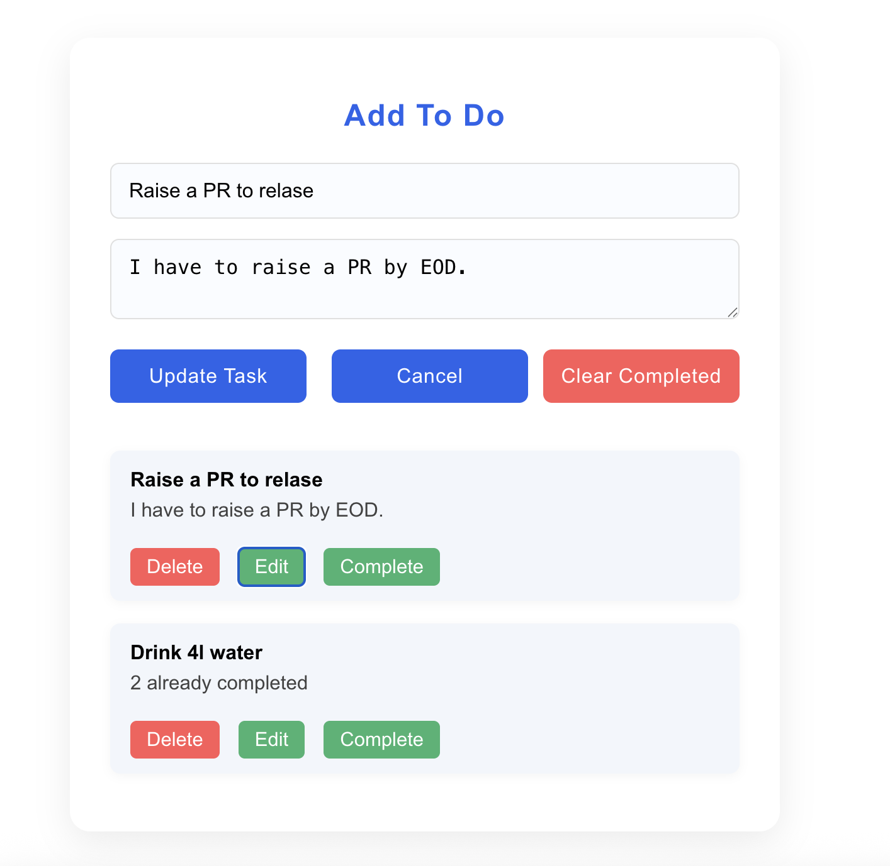

# Todo App

A simple and efficient Todo App built with React and TypeScript. Manage your daily tasks with ease — add, edit, delete, and mark them as complete. All your todos are saved in your browser's localStorage, so your data persists even after refreshing or closing the browser.

---

## Features

- **Add Todos:** Create new tasks with a heading and description.
- **Edit Todos:** Update existing tasks. Only one todo can be edited at a time; while editing, other actions are disabled.
- **Delete Todos:** Remove individual tasks from your list.
- **Mark as Complete/Incomplete:** Toggle tasks between completed and incomplete states.
- **Bulk Delete Completed:** Remove all completed tasks with a single click.
- **Persistent Storage:** Todos are stored in browser localStorage for persistence across sessions.
- **Responsive UI:** Clean, user-friendly layout that works across devices.
- **Action Button UX:** All action buttons (Edit, Delete, Complete) are aligned in a single line per todo item.
- **Cancel Editing:** Cancel an edit operation without losing your current todos.
- **(Optional) Grid View:** View todos in a grid format with AG Grid for advanced display and sorting (can be enabled/disabled in the code).
- **Visual Feedback:** Completed tasks are visually distinguished.

---

## Screenshots

<!-- Add your app screenshots here -->
<!-- Example: -->
<!--  -->

---

## Getting Started

### Prerequisites

- [Node.js](https://nodejs.org/) (version 14 or higher recommended)
- [npm](https://www.npmjs.com/) or [yarn](https://yarnpkg.com/)

### Installation

1. **Clone the repository:**

   ```bash
   git clone https://github.com/yourusername/todo-app.git
   cd todo-app
   ```

2. **Install dependencies:**

   ```bash
   npm install
   # or
   yarn install
   ```

3. **Start the development server:**

   ```bash
   npm start
   # or
   yarn start
   ```

4. **Open in your browser:**

   Visit `http://localhost:3000` to view the app.

---

## Usage

- Fill in the **Heading** and **Description** fields to add a new todo.
- Use the **Edit** button to modify a todo (other actions are disabled while editing).
- Click **Delete** to remove a todo.
- Click **Complete/Undo** to toggle a todo's completion status.
- Use **Clear All Completed task** to remove all completed todos at once.
- If you start editing but want to cancel, click **Cancel**.
- (Optional) Enable the AG Grid section in the code for advanced grid view.

---

## Project Structure

```
src/
├── components/
│   └── AddToDo.tsx         # Main Todo component
│   └── AddToDo.css         # CSS for Todo component
├── utils/
│   └── useTodos.ts         # Custom hook for localStorage integration
├── App.tsx
├── index.tsx
└── ...
```

---

## Customization

- **AG Grid View:**  
  Uncomment the `<AgGridReact />` section in `AddToDo.tsx` to enable the advanced grid/table view for todos.

- **Styling:**  
  Modify `AddToDo.css` or add your own styles for a personalized look.

---

## Contributing

Contributions are welcome! Please open an issue or submit a pull request for feature requests, bug fixes, or improvements.

---

## License

This project is licensed under the [MIT License](LICENSE).

---

## Acknowledgements

- [React](https://react.dev/)
- [TypeScript](https://www.typescriptlang.org/)
- [AG Grid](https://www.ag-grid.com/)

---

